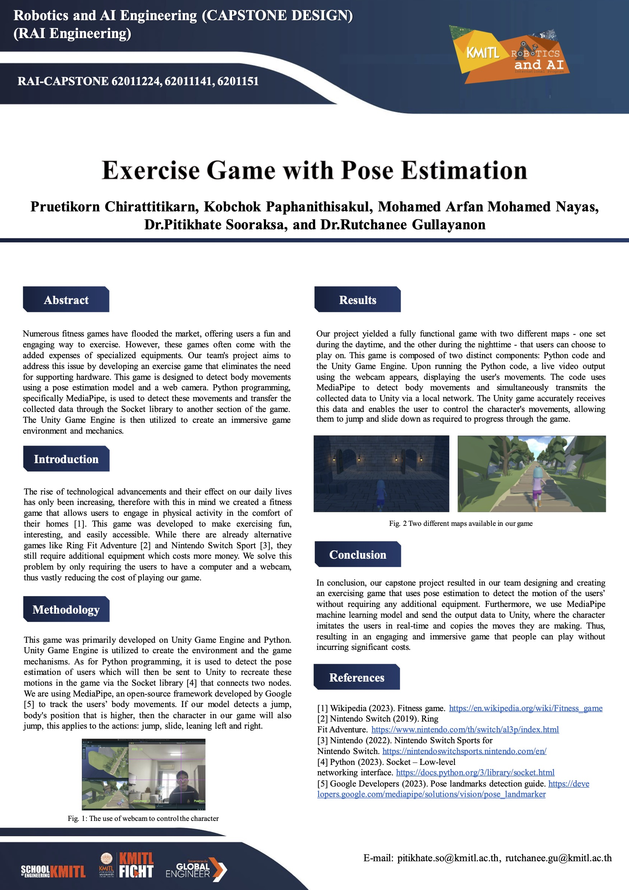

# Exercise-Game-with-Pose-Estimation

## Abstract

Numerous fitness games have flooded the market, offering users a fun and engaging way to exercise. However, these games often come with the added expenses of specialized equipments. Our team's project aims to address this issue by developing an exercise game that eliminates the need for supporting hardware. This game is designed to detect body movements using a pose estimation model and a web camera. Python programming, specifically MediaPipe, is used to detect these movements and transfer the collected data through the Socket library to another section of the game.
The Unity Game Engine is then utilized to create an immersive game environment and mechanics.

## Introduction

The rise of technological advancements and their effect on our daily lives has only been increasing, therefore with this in mind we created a fitness game that allows users to engage in physical activity in the comfort of their homes. This game was developed to make exercising fun, interesting, and easily accessible. While there are already alternative games like Ring Fit Adventure and Nintendo Switch Sport, they still require additional equipment which costs more money. We solve this problem by only requiring the users to have a computer and a webcam, thus vastly reducing the cost of playing our game.

## Methodology

This game was primarily developed on Unity Game Engine and Python.
Unity Game Engine is utilized to create the environment and the game mechanisms. As for Python programming, it is used to detect the pose estimation of users which will then be sent to Unity to recreate these motions in the game via the Socket library that connects two nodes.
We are using MediaPipe, an open-source framework developed by Google to track the users' body movements. If our model detects a jump, body's position that is higher, then the character in our game will also jump, this applies to the actions: jump, slide, leaning left and right.

## Results

Our project yielded a fully functional game with two different maps - one set during the daytime, and the other during the nighttime - that users can choose to play on. This game is composed of two distinct components: Python code and the Unity Game Engine. Upon running the Python code, a live video output using the webcam appears, displaying the user's movements. The code uses MediaPipe to detect body movements and simultaneously transmits the collected data to Unity via a local network. The Unity game accurately receives this data and enables the user to control the character's movements, allowing them to jump and slide down as required to progress through the game.

## Conclusion

In conclusion, our capstone project resulted in our team designing and creating an exercising game that uses pose estimation to detect the motion of the users' without requiring any additional equipment. Furthermore, we use MediaPipe machine learning model and send the output data to Unity, where the character imitates the users in real-time and copies the moves they are making. Thus, resulting in an engaging and immersive game that people can play without incurring significant costs.

For live demo, please click this [link](https://mohamedarfan.com/assets/liveDemo_ExerciseGame.mp4).

## Poster 

